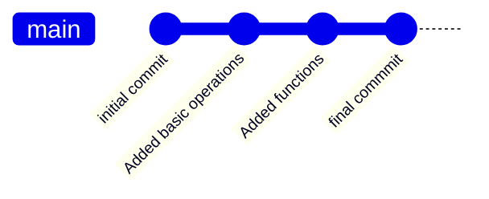
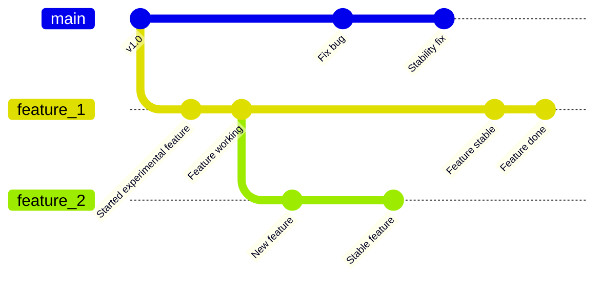
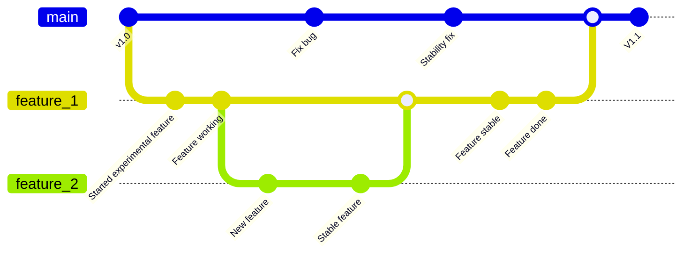

# Git-Course

# Introducción
Construir código es muy tedioso, sobretodo cuando te toca refactorizar o quieres ver una bversión anterior, por ello Linux Torvald creo aparte de las bases de los primeros SO UNIX (still going),un sistema de control de codigo fuente denominado `git`.

Otras compañías lanzaron sus propias versiones con la misma funcionalidad, gestionar las distintas versiones de código. 
## Entorno git
git : Control de codigo fuente

github: Github es un sitio web que ofrece el servicio de mantener una copia centralizada de un *repositorio* de git, también tiene soporte para *issues* y más cosas relacionadas con el desarrollo de software. **Github no es parte de git,** es una web de Microsoft hecha para funcionar con git. 

gitlab y gitea: Instalaciones adoc en servidores privados (similar a github)

## Instalación
- Linux (Ubuntu): ``sudo apt install git``
- Linux (Arch): ``pacman -S git``
- Linux (Otros): [Git - Install for Linux](https://git-scm.com/install/linux)
- Windows: [Git - Install for Windows](https://git-scm.com/install/windows) 
- Mac: [Git - Install for macOS](https://git-scm.com/install/mac)
###  Autentificación: local

```bash 
git config user.name --global "Your name here"
git config user.email --global "Your e-mail here"
```

>[!INFO] el parámetro `--global` permite que se vincule a todos los repositorios, de no usarlo solo afectaría al actual.

### Autentificación: online
Vas a la web y le das a registrarte. Es **Obligatoria** la verificación en dos pasos 

Al ser estudiantes podeis pedir [GitHub Student Developer Pack](https://education.github.com/pack).

Para poder descargaros repositorios privados de GitHub necesitais autenticaros, [recomendado usar ssh keys](https://docs.github.com/es/authentication/connecting-to-github-with-ssh):
   1. Hace tiempo que GitHub no soporta la autenticación por usuario y contraseña fuera de la web
   2. Creas claves ssh en tu ordenador usando comandos
   3. Subir clave publica a github
   4. Cuando te conectes desde tu ordenador, se usará tu clave ssh y te autenticarás
   5. Si planeas usar la clave en un ordenador compartido, al momento de crearla añadele una passphrase, si no no es necesario.
   
- vscode tiene su propia manera de autenticar.
- extensiónes para vscode que ayudan con git: git graph y git blame.

## Copiar un repositorio - ``clone``

El comando `clone` se utiliza para descargar un repositorio completo desde un servidor (como GitHub) a tu ordenador de forma **local**.

```bash 
git clone <url-del-repositorio>
```

> [!NOTE] Existe el comando `fork` (github) que permite crear una copia de un repositorio ajeno en tu cuenta.
## Guardar los cambios - ``commit``

1. Con cada cambio que se quiera guardar se hace un commit con un mensaje explicando los cambios.

    - El commit consiste en un "parche" que indica las lineas cambiadas en los ficheros.
	    
    - Los commits construyen unos encima de otros.
    
>[!INFO] Sobrescribe contenido en caso de ser necesario.
    
   - Git maneja los commits automáticamente, si en algún momento queremos volver a un commit anterior o ver en que momento se realizó cierto cambio podemos hacerlo con comandos que se explicarán más adelante 

2. Ya está, haces commits y git se encarga


Como hacer el commit:

```bash  
git add <rutaFicheros>
	 #-> Añade el fichero para commitear
git commit
     # -> Este comando abre un editor de texto para añadir el mensaje del commit
git push
     # -> Publica el commit
```    
  Los mensajes deben ser significativos:

| **✅ Buen Commit**                     | **❌ Mal Commit** |
| ------------------------------------- | ---------------- |
| `feat: add login validation`          | `cambios`        |
| `fix: resolve merge conflict in main` | `arreglo`        |
>[!INFO] Existen distintas convenciones para los nombres de los commits, como por ejemplo _[Conventional Commits](https://www.conventionalcommits.org/en/v1.0.0/)_, no es necesario seguir una convención para tener nombres descriptivos, pero son útiles para mantener un flujo de trabajo adecuado.

`git log` enseña un log de commits, es bastante configurable para que se vea mejor, como recomendación podéis añadir un alias para usar 
```bash
git log -all --oneline --decorate --graph
```

>[!INFO] [alias] añadid esto a .gitconfig y podreis usarlo de forma rápida
>````bash
>adog = log --all --decorate --oneline --graph>```
# Desarrollo Colaborativo
Para el desarrollo colaborativo se emplea un sistema de branching (o ramas en castellano). Este sistema consiste en poder bifurcar y trabajar de forma paralela e independiente.


Esto añade algunos comandos de utilidad:
```bash
git status # MUY IMPORTANTE, SIEMPRE, SIEMPRE SIEMPRE SIEMPRE
	# Ver la información actual (branch, modified files...)
git branch <newBranch>
	# Crear una branch con el nombre "newBranch"
git switch <branch>
	# Cambia a la branch "branch"
```
## Cambiar de rama con cambios - ``stash``
Si hemos realizado cambios sin commitear en una branch y queremos cambiar a otra, a veces git no sabe como aplicar nuestros cambios a la nueva branch (conflicto). Para ayudarnos a solucionar esto, existe el stash. Es un lugar donde puedes guardar tus cambios sin commitearlos ni descartarlos.

```bash
git branch otra-branch # error, you have unstaged changes blabla
git stage . 
git stash -m "cambios WIP" # guardar en el stash
git checkout otra-branch # ahora ya podrias cambiar la branch
...
#Trabajo en otra branch
...
git checkout branch-original # volvemos a donde estabamos antes
git stash pop # volvemos a tener los cambios
```

 > [!INFO] El stash es un **stack/pila (LIFO)** , por lo que no se pueden tener varios stash independientes.
## Unión de trabajo - ``merge``
Una vez se quiera juntar el desarrollo paralelo se debe hacer un `merge` de las dos branches que se desee juntar

- `git merge <branch>` crea un commit llamado `merge commit` que aplica los cambios de la rama objetivo a la rama actual
> [!INFO] Es un commit especial que tiene dos "padres" y sirve para aplicar los cambios de la rama objetivo a la rama actual.
  


En este ejemplo, en main solo se realizan directamente actualizaciones de estabilidad, el desarrollo de nuevas features se realiza en paralelo, y cuando se termina el desarrollo se hace `merge` a main, así main se mantiene siempre estable
### Los problemas de unir código - Conflicts
Cuando se juntan dos ramas, **muchas** veces puede haber conflictos, particularmente si las dos ramas hacen **cambios a las mismas partes del código**.

Cuándo se produce un conflicto git nos avisa y pausa el merge, para continuar debemos usar un editor de texto, una IDE o una interfaz de git para resolver el conflicto. Para resolverlo **debemos elegir cual de los dos cambios aplicar**, **muchas veces se aplicarán los dos** y a veces puede que sea necesario **modificar el código para aplicar una mezcla de los dos**.

>[!WARNING] Para resolver conflictos es **imprescindible** entender el propósito de los cambios, si no no sabremos que hacer
```bash
 git merge --abort 
	 # Abortar un merge que está pausado por conflictos, y volver al estado anterior

 git merge --continue 
	 # Continuar un merge pausado, después de resolver los conflictos

 git config --global merge.tool [vscode | vimdiff | meld...] 
	 # Para usar vscode seguid ([este](https://stackoverflow.com/questions/44549733/how-to-use-visual-studio-code-as-the-default-editor-for-git-mergetool-including) tutorial )

 git mergetool 
	 # Usar la herramienta que hayamos configurado para resolver conflictos
```


> [!NOTE]  Existe una forma de más avanzada de juntar dos ramas, empleando el comando `rebase`, para mas información [accede aquí](https://git-scm.com/book/es/v2/Ap%c3%a9ndice-C:-Comandos-de-Git-Parcheo)
## Actualización con el Remoto: `pull`

Fundamental cuando trabajas con GitHub para mantener tu copia local al día. Se encarga de descargar desde un repositorio remoto el contenido en la branch actual en la que estes situado  (puedes revisarlo con `git status`). 

```bash
git pull 
```
## Cambios que no te convencen - `restore`
Te permite deshacer cambios locales y volver a una versión anterior de tus archivos.

- **Deshacer cambios locales**: Vuelve un archivo al estado en el que estaba en el último commit (borra lo que has escrito pero no has guardado).
    
    - `git restore <fichero>`
        
- **Sacar de Staging zone**: Si hiciste `git add` por error y no quieres que ese archivo entre en el próximo commit.
    
    - `git restore --staged <fichero>`
        

> [!DANGER] ¡Atención! Al usar `git restore <fichero>`, los cambios que no hayas guardado en un commit **se perderán para siempre**. Úsalo solo cuando estés seguro de que quieres borrar lo que has hecho.
